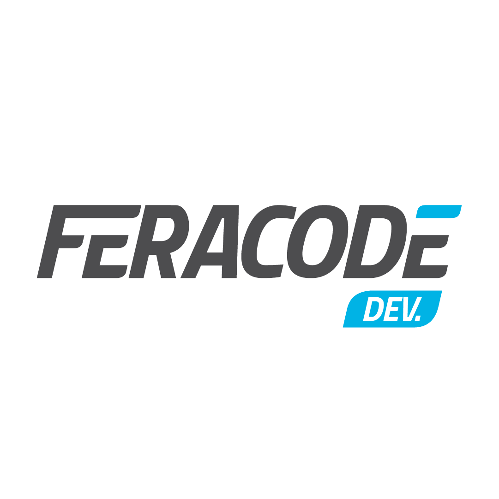

<h1 align="center">
   
</h1>

<h1 align="center">Feracode Challenge</h1>
<p align="center">
  

  <a href="https://github.com/Zagetsus">
    
  </a>

<a href="https://github.com/Zagetsus/feracode-challenge/blob/main/LICENSE">
  
</a>
</p>

---

This project is built with the `React Native` library.  
[Check the documentation](https://reactnative.dev/) for more details or see the summary in the `Configurations > React Native` section.

- Contents
    - [About the project](#about)
        - [Requirements](#requirements)
        - [Installation](#install)
        - [Running the Project](#run)
    - [Configurations](#configs)
        - Scripts
        - Typescript
        - React Native
    - [Commit standards](#commit-patterns)
    - [License](#license)

## About the project <a name="about"></a>

A mobile app for football fans to stay up to date with everything happening in football leagues around the world.  
You can check how your favorite team is performing!

### *Requirements:* <a name="requirements"></a>

- [NodeJs `>16.0.0`](https://nodejs.org/en/)
- [Yarn](https://classic.yarnpkg.com/en/docs/install/#mac-stable)

### Installation: <a name="install"></a>

After cloning the project, run the following in your terminal:

```bash 
cd feracode_challenge 
yarn # or yarn install


*Note:* After installation, run lint to check code style and formatting:

```bash
# To run lint across the whole project
yarn lint
```

### Running the Project: <a name="run"></a>

In the terminal, run:

```bash
yarn android
```

## Configurations <a name="configs"></a>

<details>
  <summary><b>Scripts</b> (click to show)</summary>

The project contains several CLI scripts available via terminal, e.g., `yarn <SCRIPT>` or `npm run <SCRIPT>`

| Script  | Description                                                                  |
| ------- | ---------------------------------------------------------------------------- |
| android | Builds and starts the development server with hot auto-reload for Android    |
| ios     | Builds and starts the development server with hot auto-reload for iOS        |
| test    | Runs project tests                                                           |
| lint    | Runs ESLINT to check the code styleguide and automatically fix simple errors |

</details>

<details>
  <summary><b>Typescript</b> (click to show)</summary>

This architecture uses [*Typescript*](https://www.typescriptlang.org/) as the main development language.
All framework features are written in TypeScript and are highly extensible, making the codebase flexible for long-term development.

While the syntax may differ from JavaScript and be unfamiliar to some developers, TypeScript brings many benefits:

* [IntelliSense support](https://code.visualstudio.com/docs/editor/intellisense) for auto-complete, parameter hints, quick info, member lists, etc.
* Better tooling for debugging, ensuring type safety and early error detection.
* Support for design patterns like Abstract, Factory, Decorator, Singleton, etc., improving code organization and reusability.
* Provides more reliable, explicit, and maintainable code.
* And much more.

The project includes `eslint` and `prettier` configurations to enforce code formatting and style.
Files like `.prettierrc` and `.eslintrc.js` define rules such as:
*mandatory use of single quotes* and *no semicolons*.

An `.editorconfig` file also enforces:

* *2-space indentation*
* *UTF-8 encoding*
* *Newline at the end of each file*

</details>

<details>
<summary><b>React Native</b> (click to show)</summary>

React Native is a JavaScript framework that allows you to build native mobile apps for both Android and iOS.

Before React Native, hybrid solutions like Apache Cordova (open-source), Adobe PhoneGap (based on Cordova), and IBM’s MobileFirst existed.

However, for native solutions, developers often needed to build apps for both platforms separately, using Java (Android) and Objective-C (iOS), without code reuse.

This increased complexity, team size, and costs.
It was common to require one JavaScript team and another Objective-C team to build similar apps in parallel.

React Native solved this by allowing developers to write a single codebase in JavaScript (with native bindings) that runs on both Android and iOS.

*Useful links:*

* [Documentation](https://reactnative.dev/)
* [Atomic Design](https://bradfrost.com/blog/post/atomic-web-design/)
* [Componentization](https://inside.contabilizei.com.br/componentização-no-front-end-f40b0b85143f)

</details>

## Commit Standards <a name="commit-patterns"></a>

This project follows the [Conventional Commits](https://www.conventionalcommits.org/en/v1.0.0/) specification as a standard for commit messages.

In addition to that, it enforces some custom rules:

* **Commit Language**: English only
* **Length**: Between 10 and 100 characters
* **Format**: `[COMMIT_TYPE]: update README to add developer tips`

Below is a table describing the available commit types:

| **COMMIT\_TYPE** | DESCRIPTION                                                        |
| ---------------- | ------------------------------------------------------------------ |
| **feat**         | A new feature                                                      |
| **fix**          | A bug fix                                                          |
| **docs**         | Documentation changes                                              |
| **style**        | Code style changes (spacing, linting, commas, etc)                 |
| **refactor**     | Code changes that neither fix a bug nor add a feature              |
| **test**         | Adding or updating tests                                           |
| **chore**        | Changes to the build process or auxiliary tools                    |
| **perf**         | Performance improvements                                           |
| **ci**           | Continuous integration related changes                             |
| **build**        | Changes that affect the build system or external dependencies      |
| **temp**         | Temporary commits not meant to be merged or added to the changelog |

## License <a name='license'></a>

This project is licensed under the MIT License.
See the [LICENSE](LICENSE) file for more details.

